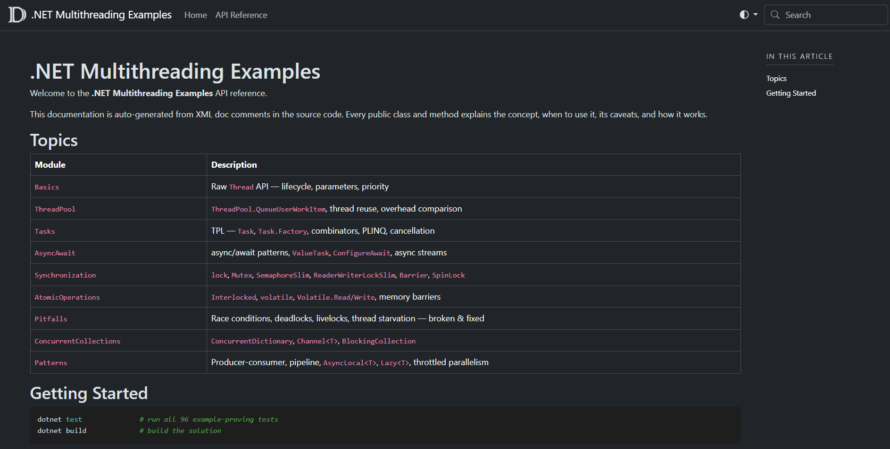

# .NET Multithreading Examples

A structured, self-contained **.NET 10** learning repository covering multi-threading from first principles to production patterns. Every concept is demonstrated in a self-documented class and proven correct by a companion unit test.

> Built for senior .NET developers who know the language well but have not used multi-threading in depth. The goal is not just to show *what* the API looks like — but *when* to use it, *why* it works, and *what goes wrong* without it.



---

## Prerequisites

- [.NET 10 SDK](https://dotnet.microsoft.com/download/dotnet/10.0)
- [DocFX](https://dotnet.github.io/docfx/) (optional, for generating the documentation site)

```bash
# Install DocFX globally (one-time)
dotnet tool install --global docfx
```

---

## Project Structure

```
multithreading/
├── DotNet.Multithreading.sln
├── src/
│   └── DotNet.Multithreading.Examples/         # Class library — all example code
│       ├── 01_Basics/                          # Raw Thread API
│       ├── 02_ThreadPool/                      # ThreadPool
│       ├── 03_Tasks/                           # Task Parallel Library
│       ├── 04_AsyncAwait/                      # async/await patterns
│       ├── 05_Synchronization/                 # lock, Mutex, SemaphoreSlim, Barrier…
│       ├── 06_AtomicOperations/                # Interlocked, volatile, memory barriers
│       ├── 07_Pitfalls/                        # Race conditions, deadlocks, livelocks
│       ├── 08_ConcurrentCollections/           # ConcurrentDictionary, Channel<T>…
│       └── 09_Patterns/                        # Producer-consumer, pipeline, AsyncLocal…
├── tests/
│   └── DotNet.Multithreading.Tests/            # xUnit tests — mirror of src structure
└── docs/
    ├── docfx.json                              # DocFX configuration
    ├── index.md                                # Documentation home page
    └── _site/                                  # Generated HTML (git-ignored)
```

---

## Running the Tests

The tests are the primary way to interact with this repository. Every example method has at least one test that **proves** the concept works (or breaks without the fix).

```bash
# Run all 96 tests
dotnet test

# Run with verbose output (shows test names and ITestOutputHelper logs)
dotnet test --verbosity normal

# Run a specific topic
dotnet test --filter "FullyQualifiedName~Synchronization"
dotnet test --filter "FullyQualifiedName~Pitfalls"

# Exclude flaky tests (race-condition documentation tests)
dotnet test --filter "Category!=Flaky"
```

---

## Topics Covered

| # | Topic | Key Concepts |
|---|-------|-------------|
| 1 | **Thread Fundamentals** | `Thread`, `Start`, `Join`, `IsBackground`, `ThreadState`, parameter-passing patterns, closure-capture gotcha |
| 2 | **ThreadPool** | `QueueUserWorkItem`, min/max threads, `RegisterWaitForSingleObject`, ThreadPool vs raw Thread overhead |
| 3 | **Task Parallel Library** | `Task.Run`, `Task.Factory.StartNew`, `ContinueWith`, `WhenAll`/`WhenAny`, `Parallel.For/ForEach/ForEachAsync`, PLINQ, `CancellationTokenSource`, `AggregateException` |
| 4 | **Async/Await** | Async state machine, `ValueTask<T>`, `ConfigureAwait(false)`, `async void` danger, sequential vs parallel awaits, `IAsyncEnumerable<T>` |
| 5 | **Synchronization Primitives** | `lock`/`Monitor`, `Mutex`, `SemaphoreSlim`, `ManualResetEventSlim`, `AutoResetEvent`, `CountdownEvent`, `ReaderWriterLockSlim`, `Barrier`, `SpinLock`, `SpinWait` |
| 6 | **Atomic Operations & Memory Model** | `Interlocked.Increment/Add/CompareExchange`, CAS loop pattern, `volatile`, `Volatile.Read/Write`, `Thread.MemoryBarrier` |
| 7 | **Pitfalls & Anti-Patterns** | Race conditions, AB-BA deadlocks, livelocks, thread starvation, `.Result`/`.Wait()` deadlock |
| 8 | **Concurrent Collections** | `ConcurrentDictionary`, `ConcurrentQueue`/`Stack`/`Bag`, `BlockingCollection`, `Channel<T>` with backpressure |
| 9 | **Patterns & Recipes** | Producer-consumer, three-stage pipeline, `AsyncLocal<T>` vs `ThreadLocal<T>`, `Lazy<T>`, throttled parallelism |

### How the examples are structured

- Each source file opens with a **header comment** explaining the concept, a one-line summary, and a *When to use / When NOT to use* guide.
- All public classes and methods carry **XML doc comments** with concept explanations, parameter descriptions, and caveats.
- Pitfall classes provide a **`Broken` method** (exhibiting the problem) and a **`Fixed` method** (showing the solution) side by side.
- Tests never use `Thread.Sleep` for coordination — they use `CountdownEvent`, `Barrier`, `SemaphoreSlim`, and other correct primitives.

---

## Documentation Site

Full API documentation is generated from the XML doc comments using **[DocFX](https://dotnet.github.io/docfx/)** — Microsoft's open-source documentation tool.

### Generate the site

```bash
cd docs
docfx docfx.json
```

This reads the C# source under `src/`, extracts all XML doc comments, and writes a complete HTML site to `docs/_site/`.

### Preview locally

```bash
docfx serve docs/_site --port 8080
# Then open http://localhost:8080 in your browser
```

### What the site contains

- A **home page** (`index.md`) with a topic table and quick-start commands.
- An **API reference** with one page per class — every public method listed with its full description, parameters, return value, and remarks.
- **Full-text search** across all concepts.

The `docs/_site/` and `docs/api/` folders are git-ignored (generated output). Regenerate them any time after editing the XML doc comments by running `docfx docfx.json` again.

---

## Technology Choices

| Tool | Version | Why |
|------|---------|-----|
| .NET | 10.0 | Latest LTS; uses C# 14 language features |
| xUnit | 2.9.x | Idiomatic test framework for modern .NET |
| FluentAssertions | 8.x | Readable assertion syntax (`result.Should().Be(...)`) |
| DocFX | 2.78.x | Microsoft's documentation generator; reads XML doc comments directly from C# source |

---

## Build & Test from Scratch

```bash
git clone <repo-url>
cd multithreading

dotnet restore
dotnet build
dotnet test
```
